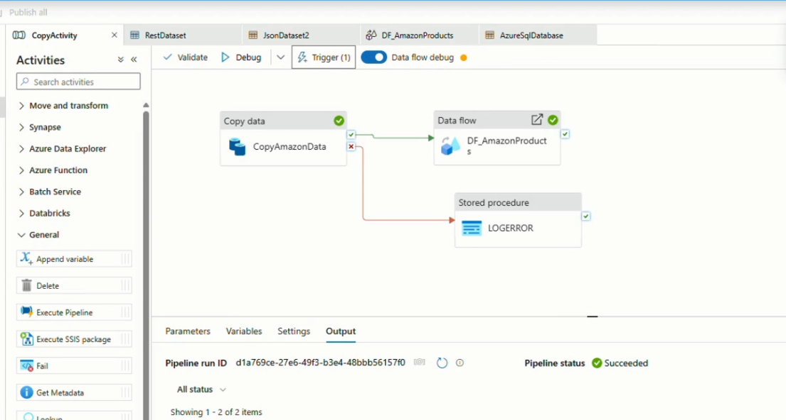
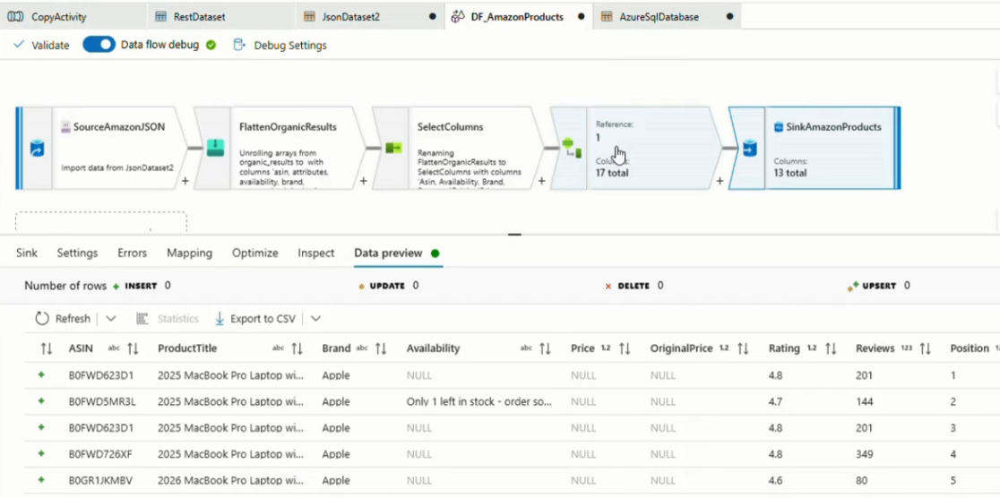
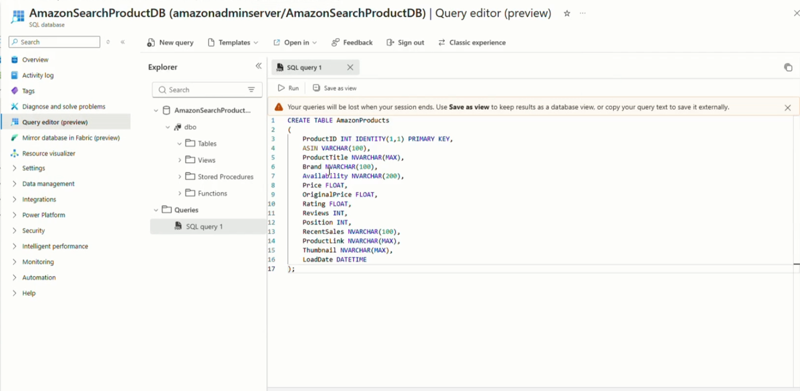
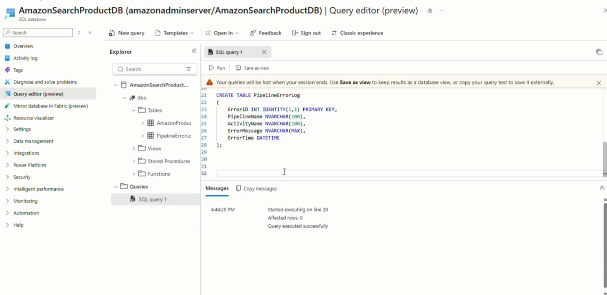
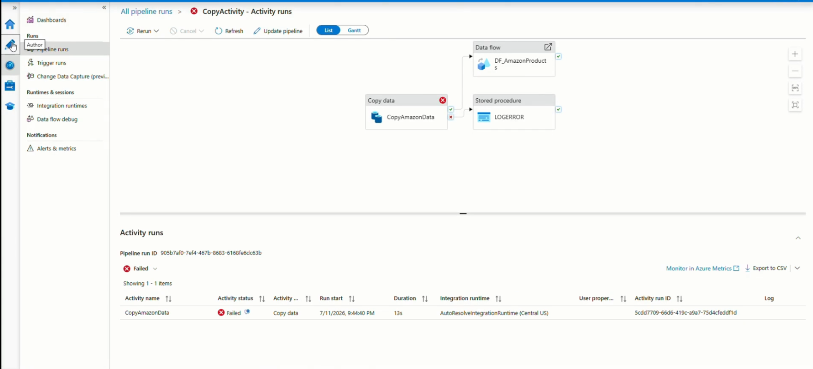
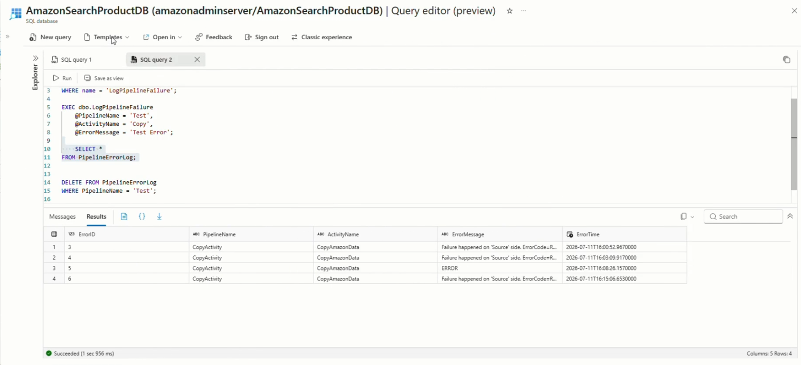

# 🚀 Live Search Trends Pipeline using Azure Data Factory

---

# 📌 Project Overview

This project demonstrates an end-to-end Azure Data Engineering pipeline that extracts Amazon product data from the SearchAPI REST API, stores raw JSON data in Azure Data Lake Storage, transforms nested JSON using Azure Data Factory Mapping Data Flow, and loads clean data into Azure SQL Database.

The pipeline also includes monitoring and error handling using Azure Data Factory.

---

# 🎯 Project Goal

Build an automated ETL pipeline that:

- Retrieves Amazon product data using REST API
- Stores raw JSON files in Azure Data Lake Storage
- Cleans and transforms nested JSON
- Loads transformed data into Azure SQL Database
- Implements monitoring
- Performs error handling

---

# 🛠 Technologies Used

- Azure Data Factory
- Azure SQL Database
- Azure Data Lake Storage Gen2
- REST API
- JSON
- Mapping Data Flow
- SQL
- Git
- GitHub

---

# 📈 Features

✔ Automated ETL Pipeline

✔ REST API Integration

✔ JSON Transformation

✔ Azure SQL Loading

✔ Error Handling

✔ Monitoring

✔ Scalable Design

---

# 🏗 Architecture

```text
SearchAPI REST API
        │
        ▼
 Copy Activity
        │
        ▼
Azure Data Lake Storage
        │
        ▼
 Mapping Data Flow
        │
        ▼
Azure SQL Database
        │
        ▼
Monitoring & Error Handling
```


---

# ⚙ Pipeline Workflow

### Step 1
Extract Amazon product data from REST API.

### Step 2
Store raw JSON into Azure Data Lake Storage.

### Step 3
Transform nested JSON using Mapping Data Flow.

### Step 4
Flatten JSON arrays.

### Step 5
Convert data types.

### Step 6
Load data into Azure SQL Database.

### Step 7
Monitor the pipeline.

### Step 8
Handle pipeline failures using Stored Procedure.

---

# 📷 Screens

### 1. Azure Data Factory Pipeline



### 2. Raw JSON Data in Azure Data Lake


### 4. Mapping Data Flow



### 5. Azure SQL Database - AmazonProducts



### 5. Azure SQL Database - PipelineErrorLog



### 6. Pipeline Monitoring



### 7. Error Handling



---

# 🎥 Demo Video

https://youtu.be/T6qaYsSJFM4

---

# 👩‍💻 Author

**Athira N K**

Azure Data Engineer
