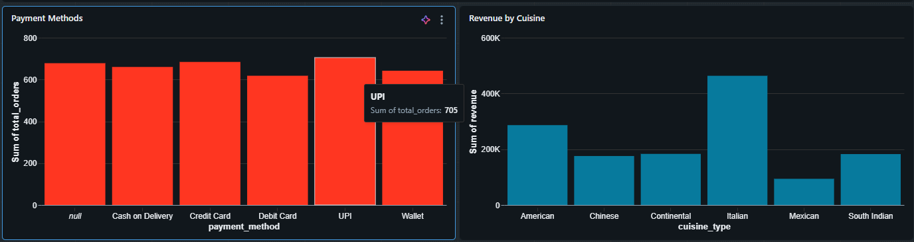
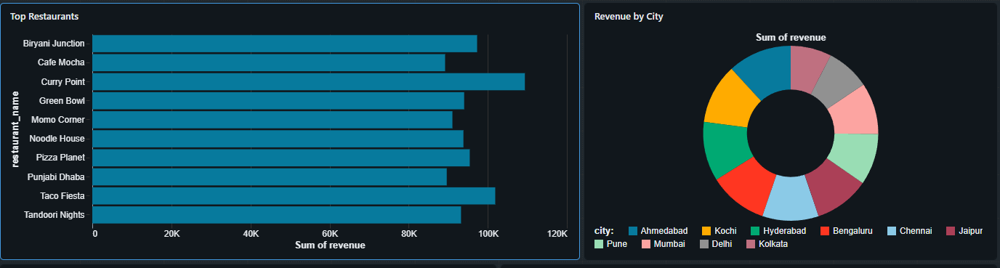
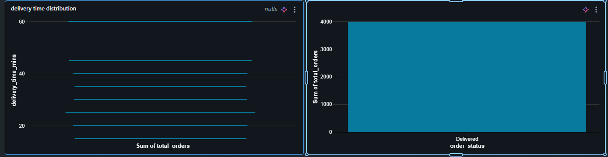
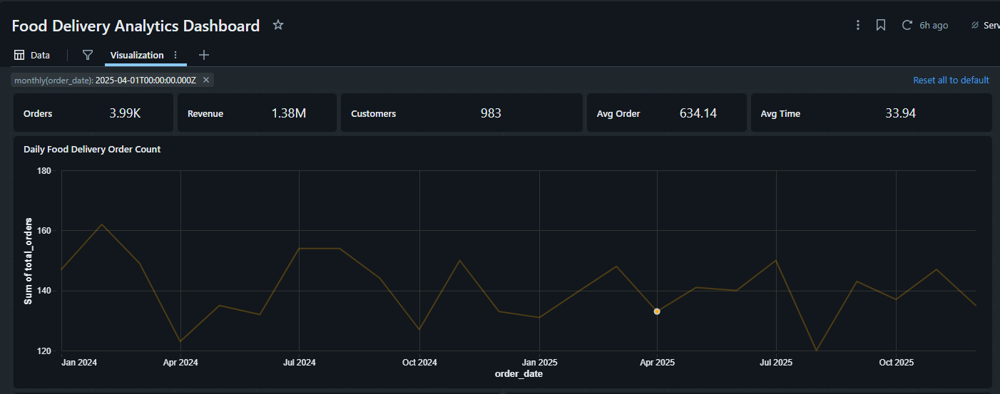

🍔 Food Delivery Analytics using Databricks Medallion Architecture
---
# 📌 Project Overview

This project demonstrates an end-to-end Data Engineering pipeline built using Databricks, PySpark, and Delta Lake by implementing the Medallion Architecture (Bronze → Silver → Gold).

The objective is to ingest messy data from multiple business sources, perform data quality checks and transformations, create analytics-ready tables, and build an interactive dashboard for business users.

---

# 🎯 Business Problem

A food delivery company receives data from multiple systems:

Customer Management System (CRM)
Orders & Payment System
Restaurant Partner Management

The exported files contain inconsistent formats, duplicate records, missing values, incorrect data types, invalid values, and incomplete business information.

The goal is to transform these raw datasets into trusted, analytics-ready data for reporting and decision-making.

---

# 🛠 Technologies Used
Technology	Purpose <br>
Databricks	Data Engineering Platform <br>
PySpark	Data Processing <br>
Delta Lake	Data Storage<br>
SQL	Data Analysis <br>
Databricks Catalog	Data Management <br>
Lakeview Dashboard	Visualization <br>
GitHub	Version Control

---

# 📂 Source Datasets

Dataset	                              Description

delivery_customers_messy.csv	        Customer information
delivery_orders_messy.csv	            Food orders
delivery_restaurants_messy.csv	      Restaurant information

---
# 🏗 Architecture

```text
                 Raw CSV Files
                        │
        ┌───────────────┼───────────────┐
        │               │               │
 Customers.csv     Orders.csv     Restaurants.csv
        │               │               │
        └────────── Bronze Layer ───────┘
                        │
                 Data Validation
                 Data Cleaning
                 Data Standardization
                        │
                Silver Layer
                        │
         Business Transformations
         Star Schema Creation
         Aggregations
                        │
                  Gold Layer
                        │
            Lakeview Dashboard
```

---

## Bronze Layer

The Bronze layer stores raw ingested data without any business transformations.

Tasks Performed

- Read CSV files
- Added ingestion timestamp
- Stored raw data as Delta Tables

---

## Silver Layer

The Silver layer performs data cleansing and standardization.

### Customers

- Standardized membership status
- Removed duplicate customer IDs
- Standardized date formats
- Validated phone numbers
- Converted wallet balance to Decimal
- Corrected city-state mismatches

### Orders

- Standardized order status
- Removed invalid item counts
- Converted order value to Decimal
- Derived total amount
- Parsed order dates
- Standardized payment methods
- Converted delivery time to Integer

### Restaurants

- Standardized cuisine types
- Trimmed restaurant names
- Removed duplicates
- Converted cost for two
- Converted active flag to Boolean

---

## Gold Layer

Created business-ready tables.

• dim_customer

• dim_restaurant

• dim_date

• fact_orders

• daily_order_summary

• cuisine_performance

• restaurant_performance

---

## Dashboard

Interactive dashboard built using Databricks Lakeview.

Features

• KPI Cards

• Orders Trend

• Revenue by Cuisine

• Order Status

• Payment Method Analysis

• Top Restaurants

• Revenue by City

• Delivery Time Distribution

---
# 📷 Screens

### 1. Dashboard













---

## Skills Demonstrated

✔ PySpark

✔ Spark SQL

✔ Delta Lake

✔ Data Cleaning

✔ Data Validation

✔ Medallion Architecture

✔ Data Warehousing

✔ Dashboard Development

✔ GitHub Documentation

---

# 👩‍💻 Author

**Athira N K**

Azure Data Engineer
