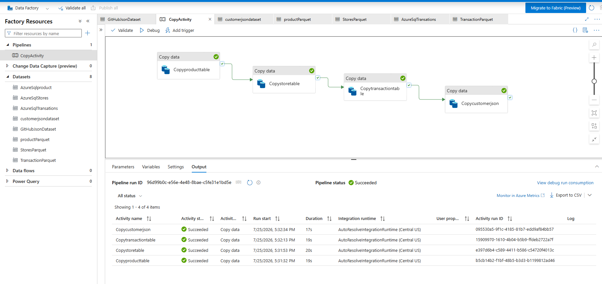
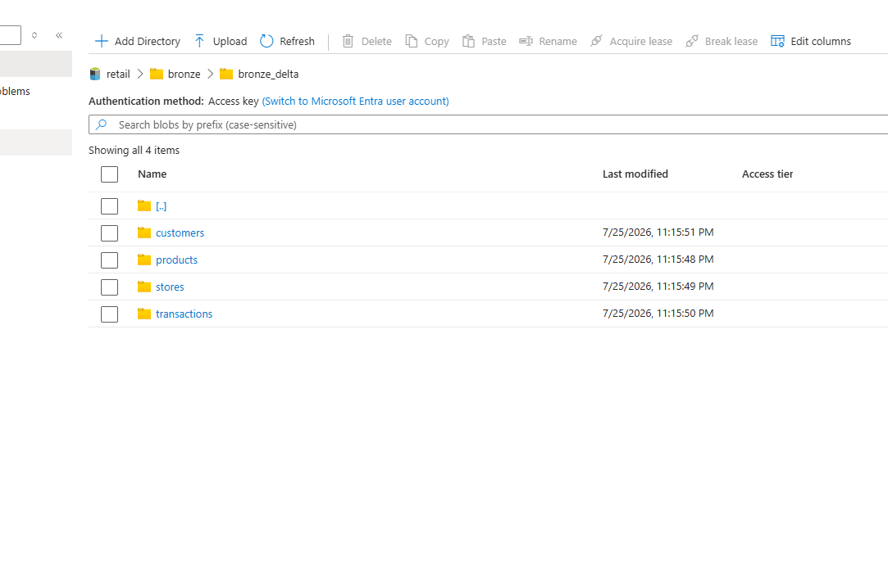
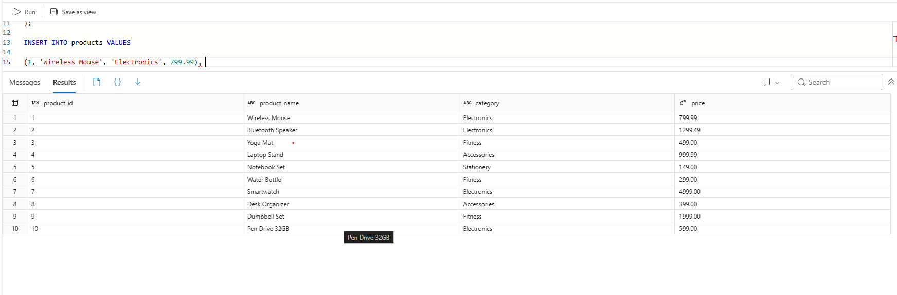
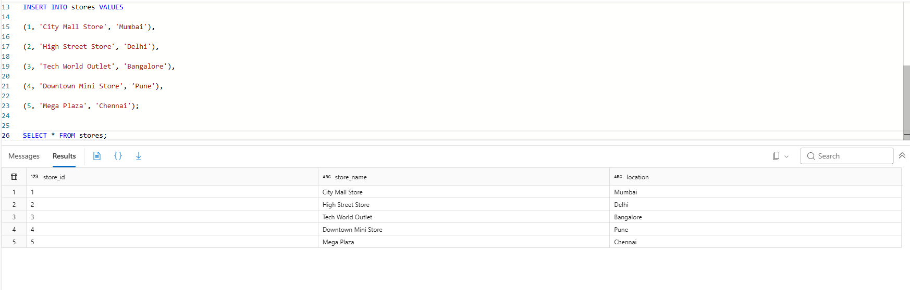
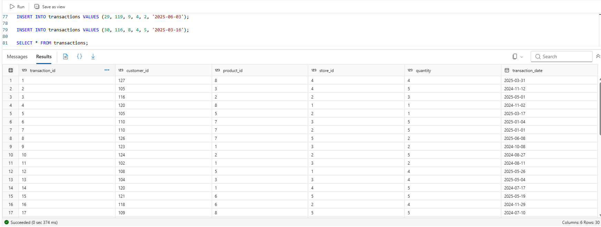

# 🚀 End-to-End Retail Sales Analytics Platform using Azure
---

# 📌 Project Overview

This project demonstrates an end-to-end Retail Sales Analytics platform by integrating data from multiple sources, implementing the Medallion Architecture, transforming data using Databricks, and delivering business insights through Power BI dashboards.

The pipeline also includes monitoring and error handling using Azure Data Factory.

---

# 🎯 Project Goal

Build and implement a scalable end-to-end Azure Data Engineering pipeline that integrates retail sales data from multiple sources, applies data transformations using the Medallion Architecture, and delivers business-ready insights through an interactive Power BI dashboard.

---

Technology Stack
- Azure SQL Database
- Azure Data Factory (ADF)
- Azure Data Lake Storage Gen2 (ADLS)
- Azure Databricks (PySpark)
- Power BI

---

📂 Dataset

The project uses four datasets.

Azure SQL Database

  Products

  Stores

  Transactions

+

GitHub JSON

  Customers

---

📁 Project Structure

                                      Retail Sales Analytics Architecture
          
                                             +-------------------------+
                                             |      GitHub JSON        |
                                             |     Customers Data      |
                                             +-----------+-------------+
                                                         |
                                                         |
          +-------------------------+                     |
          | Azure SQL Database      |                     |
          | Products                |                     |
          | Stores                  |                     |
          | Transactions            |                     |
          +-----------+-------------+                     |
                      \                                   /
                       \                                 /
                        \                               /
                         +-----------------------------+
                         |     Azure Data Factory      |
                         |      ETL Orchestration      |
                         +-------------+---------------+
                                       |
                                       |
                            Azure Data Lake Storage Gen2
                                       |
                +----------------------+----------------------+
                |                      |                      |
                |                    Bronze                  |
                |             Raw Delta / Parquet            |
                +----------------------+----------------------+
                                       |
                                Azure Databricks
                                       |
                            Data Cleaning & Validation
                                       |
                +----------------------+----------------------+
                |                      |                      |
                |                    Silver                  |
                |          Cleaned Delta Tables              |
                +----------------------+----------------------+
                                       |
                               Business Transformations
                                       |
                +----------------------+----------------------+
                |                      |                      |
                |                     Gold                   |
                |      Analytics Ready Sales Dataset         |
                +----------------------+----------------------+
                                       |
                              Azure SQL (RetailSalesGold)
                                       |
                                  Power BI Dashboard
                                       |
                         Business KPIs & Interactive Reports
     
---

                      MEDALLION ARCHITECTURE

             Bronze
       -----------------
       Raw Data
       No Transformations
       Historical Copy
              |
              |
              V
             Silver
       -----------------
       Data Cleaning
       Remove Duplicates
       Data Validation
       Standardization
       Feature Engineering
              |
              |
              V
              Gold
       -----------------
       Business Ready
       Joined Dataset
       KPI Calculations
       Reporting Layer
       

🥉 Bronze Layer – Raw Data Ingestion

The Bronze layer stores raw data exactly as received from the source system.

Activities Read Parquet files Validate schema Store raw data Preserve original records Bronze Tables

Stored every dataset separately inside the Bronze container and Convert into Delta Format

---

🥈 Silver Layer – Data Cleaning & Standardization

The Silver layer performs data cleaning and transformation.

Transformations include:

Customer Notebook:
Read Bronze customers
Checked for missing values
Removed duplicates
Standardized data types
Saved to Silver

Product Notebook:
Read Bronze products
Removed duplicate products
Validated product information
Standardized column names
Saved to Silver

Store Notebook:
Read Bronze stores
Removed duplicate store records
Standardized location values
Saved to Silver

Transaction Notebook:
Read Bronze transactions
Converted transaction dates
Checked numeric columns
Removed duplicate transactions
Saved cleaned data

---

🥇 Gold Layer – Business Data
The Gold layer read all Silver tables and created a single business-ready dataset

Joined Tables

Transactions

+

Products

+

Customers

+

Stores

The final Gold dataset was saved as a Delta table in ADLS.

Final Gold Table is "RetailSalesGold" This table is used directly by Power BI.

---

📊 Power BI Dashboard The dashboard provides a complete business overview.

The Power BI dashboard provides a comprehensive overview of the retail business by visualizing sales performance, customer insights, product trends, and store analytics using the transformed Gold layer data.

📌 KPI Cards
Total Sales Amount
Total Customers
Total Transactions
Total Quantity Sold
Average Order Value

📈 Visualizations
Sales Trend Over Time
Sales by Product Category
Sales by Store
Top Selling Products
Customer Registration Trend
Geographic Sales Distribution (Map)
Revenue by Category
Monthly Sales Analysis

---

📊 DAX Measures

Total Sales Amount = SUM(RetailSalesGold[SalesAmount]) 

Total Customers = DISTINCTCOUNT(RetailSalesGold[CustomerID])

Total Transactions = DISTINCTCOUNT(RetailSalesGold[TransactionID])

Total Quantity Sold = SUM(RetailSalesGold[Quantity])

Average Order Value = AVERAGE(RetailSalesGold[SalesAmount])

---
📷 Screens

### 1. Azure Data Factory Pipeline

### 2. Raw Data in Azure Data Lake

### 3. Azure SQL Database - Products

### 4. Azure SQL Database - Stores

### 5. Azure SQL Database - Transactions

### 6. Resources used

### 7. Dashboard view

---

🚀 Features

End-to-End Data Engineering Project Data factory Pipeline Lakehouse Architecture Medallion Architecture PySpark Data Transformation Delta Tables Retail Sales Analytics Power BI Dashboard Business KPIs

---

🎓 Skills Demonstrated

Data Engineering Data Transformation Data Cleaning Power BI DAX Data Visualization Business Intelligence

---

# 👩‍💻 Author

**Athira N K**

Azure Data Engineer

